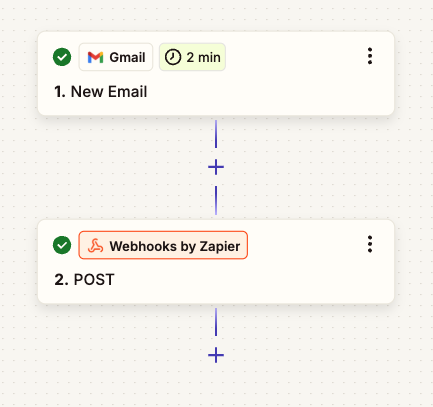
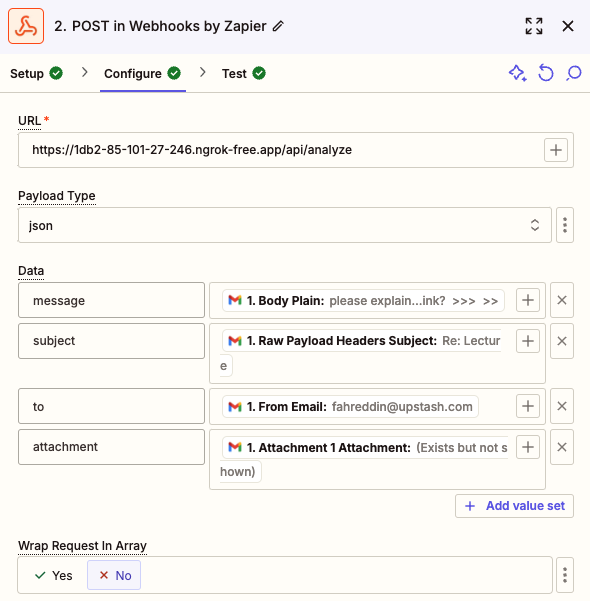

# Email Analysis Workflow with DeepSeek V3

This project allows you to automatically analyze email threads and their attachments using AI. When you forward an email to specific email address, Zapier will trigger a webhook that processes the content and sends back an AI generated response suggestion.

## Setup Instructions

For more detailed setup guide, see the [related blog post](https://upstash.com/blog/email-analysis-agent).

### 1. Set Environment Variables

This application uses **Resend** to send emails and **DeepSeek** for LLMs. To run the application, you need the following environment variables in the `.env` file.

```
DEEPSEEK_API_KEY=
QSTASH_TOKEN=
RESEND_API_KEY=
```

### 2. Deploy Your API Endpoint

First, deploy your API endpoint that will receive the webhook from Zapier. The endpoint should be accessible at

```
https://<YOUR_VERCEL_DOMAIN>/analyze
```

You can also use `ngrok` to setup a publicly accessible endpoint on your local. See [local development guide](https://upstash.com/docs/workflow/howto/local-development)

### 3. Configure Zapier Integration

#### Step 1: Create a New Zap

1. Go to [Zapier](https://zapier.com) and click "Create Zap"
2. Name your Zap (e.g., "Email Analysis Workflow")

#### Step 2: Configure Gmail Trigger

1. Choose "Gmail" as your trigger app
2. Select "New Email" as the trigger event
3. Connect your Gmail account if not already done. This email address will be the account you'll forward the emails to get the response suggestions.
4. Optional: Add filters to only trigger on specific emails



#### Step 4: Configure Webhook Action

1. Add a new action step
2. Choose "Webhooks by Zapier"
3. Select "POST" as the action event
4. Configure the webhook with these settings:

- **URL**: Your API endpoint (e.g., `https://your-domain.com/api/analyze`)
- **Payload Type**: `json`
- **Data**:
  ```json
  {
    "message": "{{body_plain}}",
    "subject": "{{subject}}",
    "to": "{{to_email}}",
    "attachment": "{{attachment_1}}",
	"attachment_type": "{{attachment_type}}"
  }
  ```
- **Wrap Request in Array**: No
- **Unflatten**: Yes



### Field Mappings

- `message`: Use Gmail's "Body Plain" field
- `subject`: Use Gmail's "Raw Payload Headers Subject" field
- `to`: Use Gmail's "From Email" field
- `attachment`: Use Gmail's "Attachment 1 Attachment" field
- `attachment_type`: The type of the attachment, currently only `application/pdf` is available on backend.

## Limitations

- Currently handles one attachment per email
- Supports PDF attachments
- Maximum email size limit based on your API endpoint's limitations
